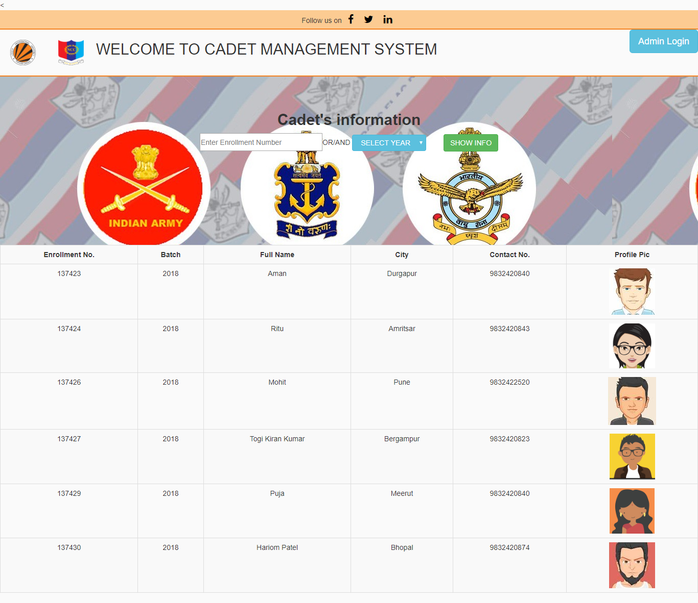
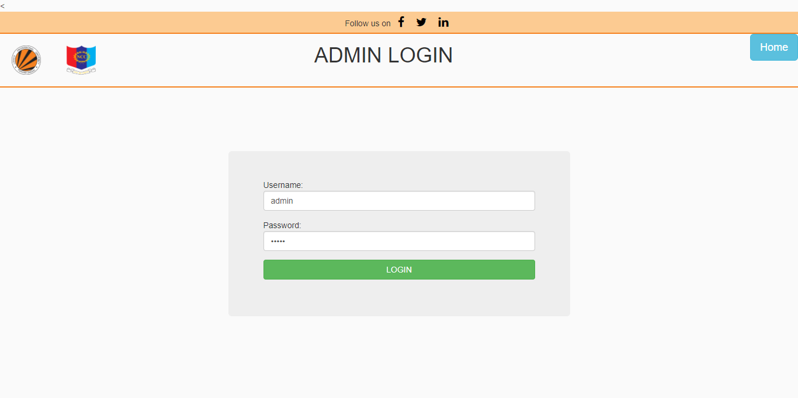
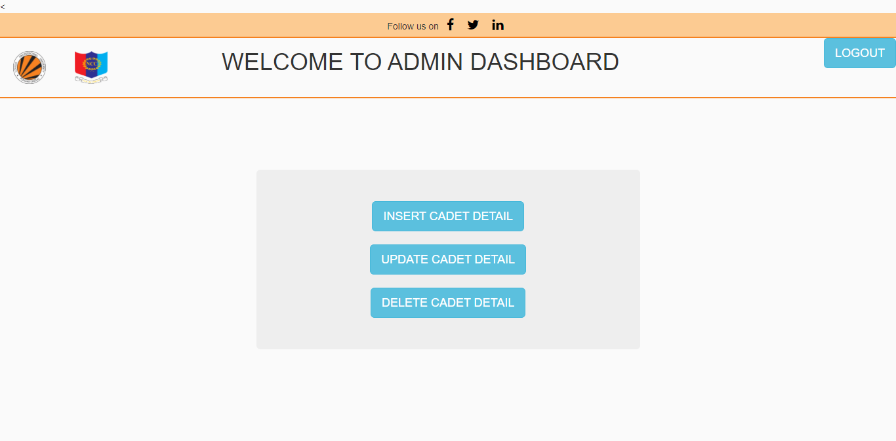
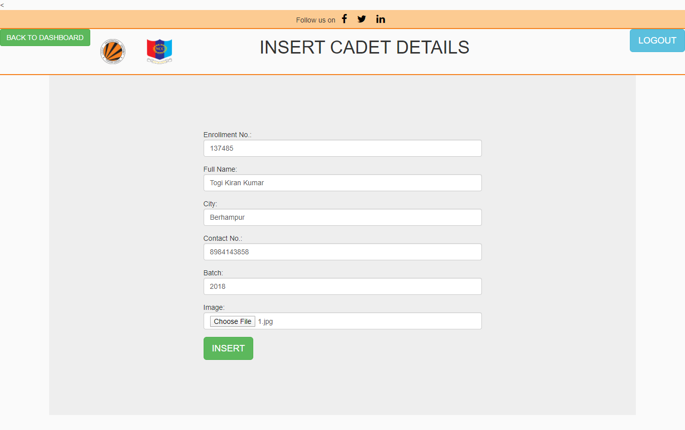
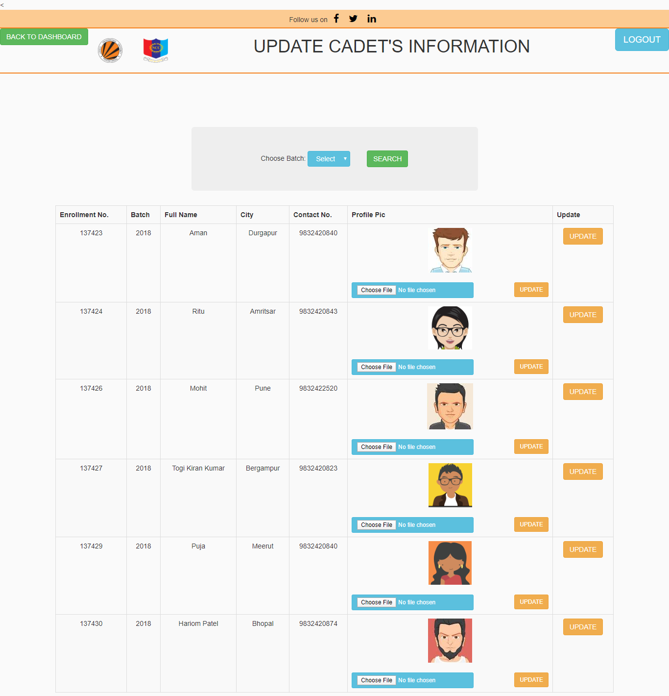
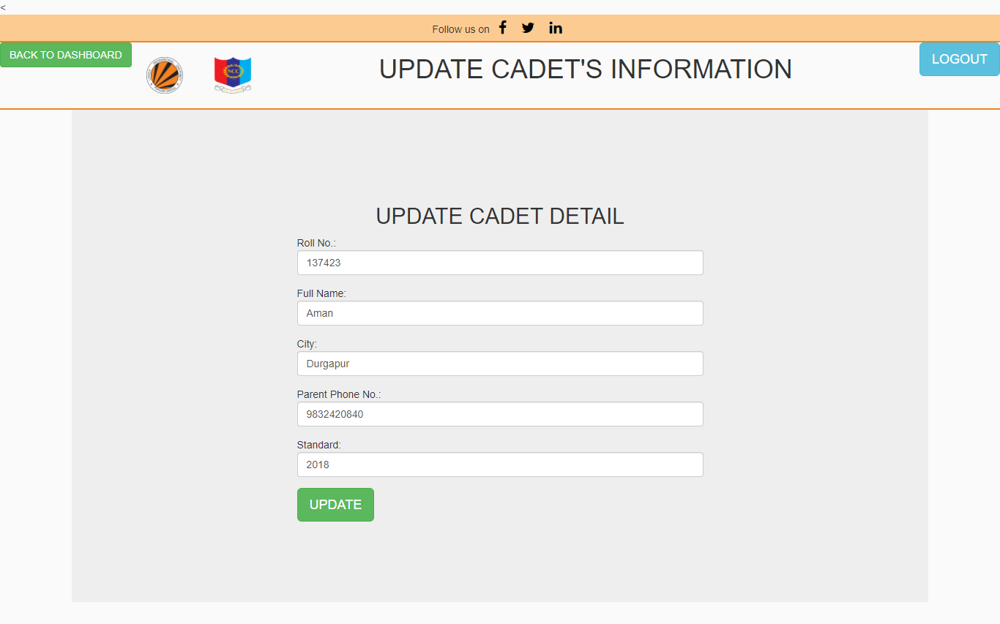
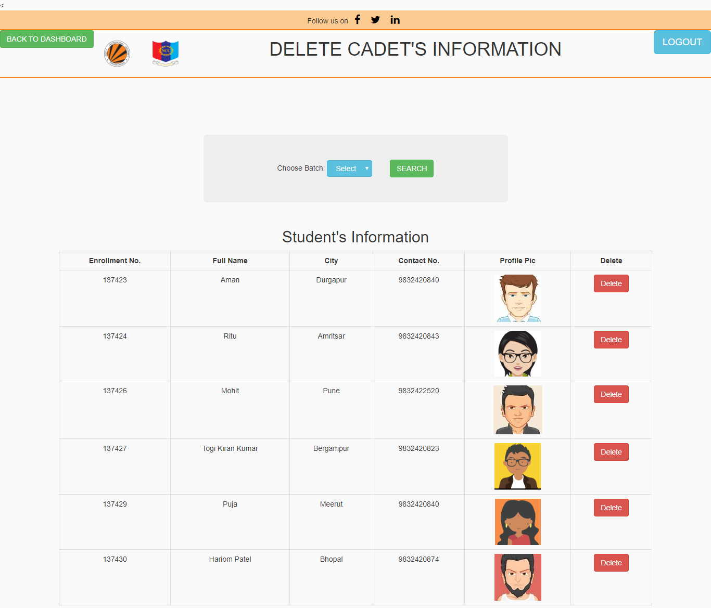

# Cadet Management System
The Cadet Details Management System In PHP is a simple mini project for keeping records of NCC Cadets. The project is mainly for the admin side. The admin has to manage all the management like adding cadet’s details, updating them, and deleting them. Admin has an important role in the management of this system.

## About System
This Cadet Details Management System is in PHP,Bootstrap and CSS. Talking about the features of the system, it contains the Admin section. From here, the admin can add, update, and delete the records of his/her cadtes. But to view the cadets’s records, you don’t have to log in to the admin page. You can search for the information of any cadet from the home page.

The design of this project is pretty simple so that the user won’t find any difficulties while working on it. This System in PHP helps in easy management of records of the cadets.

## How To Run The Project?
To run this project, you must have installed a virtual server i.e XAMPP on your PC (for Windows). This Student Details Management System is in PHP with source code is free to download, Use for educational purposes only!

After Starting Apache and MySQL in XAMPP, follow the following steps.

- Extract file
- Copy the main project folder
- Paste in xampp/htdocs/
- Open a browser and go to URL “http://localhost/phpmyadmin/”
- Then, click on the databases tab
- Create a database naming “sms” and then click on the import tab
- Click on browse file and select “test(1).sql” file which is inside the “sql” folder
- Click on go.After Creating Database,
- Open a browser and go to URL “http://localhost/SMS/”

NOTE: For admin login, username: admin password: admin

## Landing Page

## Admin Login Page

## Admin Dashboard

## Insert cadet's information

## Update cadet's information

## Update Details

## Delete Cadet's information

## Main Page

